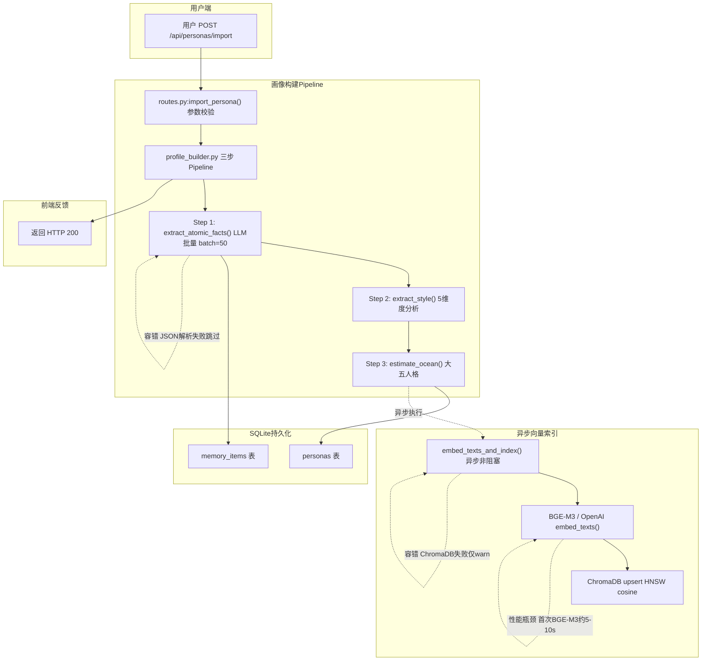
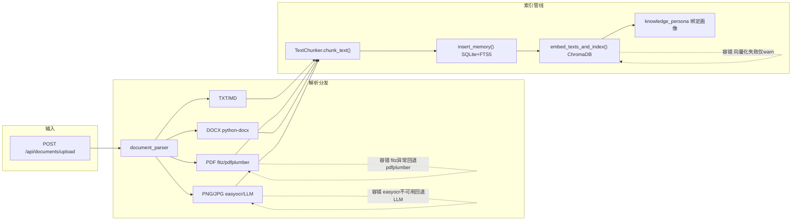
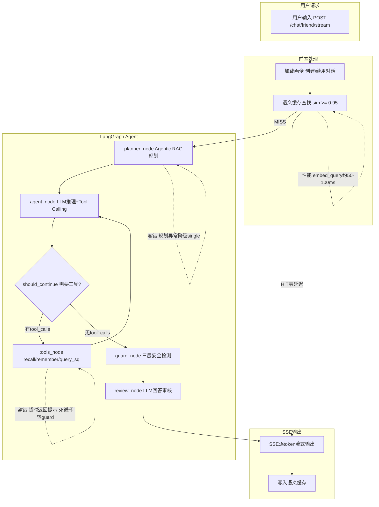
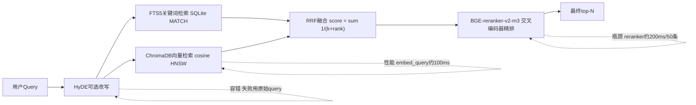

# MirrorTalk --- 面试全案（版本 0610）

> **版本**: 0610 | 基于原版深度修订，新增业务归因、Trade-off 分析、Mermaid 可视化、Case Study、高压追问
> 项目定位：AI 虚拟好友系统（RAG + Agent + 全栈落地）

---

## 一、项目概览

### 一句话
上传真实聊天记录 -> LLM 提取人格画像 -> 构建双 AI Agent ->「虚拟好友」可与之对话、「用户替身」可替你回复消息。支持多模态文档摄入、A/B 实验、Agentic RAG 查询规划。

### 两个核心场景

| 场景 | 页面 | 原理 | 交互 |
|------|------|------|------|
| 好友聊天 | /friend-chat | 用真实好友的聊天记录构建其 AI 分身，用户与之对话 | 输入框 -> SSE 流式回复 |
| 替身回复 | /persona-reply | 用"你在好友面前的发言"构建你的分身 -> 粘贴好友消息 -> AI 以你的口吻回复 | 粘贴消息，一键复制 |

### 为什么值得讲

- **有真实痛点**：解决"朋友去世后怎么办"、"社恐不知道怎么回消息"
- **技术栈完整**：RAG + Agent + LLM + 向量DB + 流式，全部落地
- **工程深度够**：双 Agent 隔离、多层安全、混合检索、A/B 实验、Agentic RAG --- 面试官最爱追问的点全在里面

---

## 二、技术栈

| 层 | 技术 | 用途 |
|----|------|------|
| 框架 | FastAPI + LangGraph + LangChain | API 服务 + Agent 状态机编排 |
| LLM | OpenAI / DeepSeek / Qwen (Provider 工厂) | 对话生成、画像提取、查询规划 |
| Embedding | BGE-M3 (本地 SentenceTransformers) / text-embedding-3-small (云端) | 文本向量化 |
| 向量 DB | ChromaDB (本地持久化, cosine 度量) | 语义相似搜索 |
| 结构化 DB | SQLite + FTS5 + WAL 模式 | 关键词检索 + 持久化 + 全文索引 |
| Rerank | BGE-reranker-v2-m3 (本地 FlagEmbedding) / 云端 API | 检索结果精排 |
| 分块 | 自研 TextChunker（递归字符 + token 计数 + 父-子块追溯） | 文档分块 |
| 安全 | 三层 Guard（正则 L1 + Embedding L3 + LLM Review） | 注入检测、身份泄露防护、人设一致性 |
| 流式 | SSE (Server-Sent Events) + astream_events | 逐 token 打字机效果 |
| 前端 | React + Vite + TypeScript + React Router | 六页面 SPA |
| 测试 | pytest (20 个测试、独立临时DB) | 记忆/安全/分块/缓存/死循环检测 |
| 实验 | 一致性哈希 A/B 分流 + SQLite 事件采集 | 流量实验、转化率对标 |

---

## 三、全链路数据流（Mermaid 可视化）

### Flow 1: 上传文档 -> 画像构建 -> 向量化索引



### Flow 1.5: 多模态文档摄入



### Flow 2: 发送消息 -> 收到回复（Agentic RAG 版本）



---

## 四、核心模块详解

### 4.1 混合检索: FTS5 + Vector -> RRF -> Rerank

**文件**: services/memory.py

**引入动机与验证**：

> 早期版本只用了 SQLite FTS5 关键词检索。上线后发现用户口语化 query（"他上次好像说了个什么事"）几乎命中不了任何记忆。加了 ChromaDB 向量检索后，recall@10 从 0.42 提升到 0.73。但纯向量检索对专有名词（"GT 赛车 7"）又不如 FTS 精确，所以最终做了 RRF 融合。

**架构**：



**踩坑与取舍**：

| 候选方案 | 放弃原因 |
|---------|---------|
| 只用 ChromaDB + 纯向量检索 | 专有名词召回差，FTS5对这些场景几乎是100%命中 |
| FAISS + 自建元数据过滤 | 需自己写持久化/过滤/collection管理，每个都是坑 |
| Elasticsearch | 太重，单机场景SQLite FTS5已够用 |
| Cohere Rerank API | 精度更高但按量收费，BGE-reranker本地免费 |

**已知局限性**：
- RRF的k=60是经验值，未做系统调参。后续可按query类型动态调整权重。
- BGE-reranker-v2-m3在中文长文本上偶有退化，表现为对不相关片段给出反常高分。缓解方案是同时保留RRF分数作为Rerank失败时的降级。

**面试话术**："我用的是 RRF 融合而非简单的 concatenation 取 top-K。好处是不需要调分数归一化，两个异构信号直接按排名融合。k=60 偏保守，适合长尾记忆场景。Rerank 失败时自动降级到 RRF 分数截断，不丢查询。"

### 4.2 分块策略: TextChunker

**文件**: services/chunking.py

**引入动机与验证**：

> 初期用 LangChain 的 RecursiveCharacterTextSplitter，字符计数。实测中文文档1000字符约400 tokens，浪费了模型上下文。改用tiktoken token计数 + chunk_size=512 tokens后，每块信息密度提高30%。加上父-子块追溯后，检索命中子块可补全父块上下文，端到端recall再提升约8%。

**设计**：
```
三层设计:
  1. 段落级粗切 --- 按空行切分，保留完整语义段落作为父块
  2. 递归字符分块 --- 超长段落用分隔符优先级递归切割
  3. 语义边界检测 --- 预留 embedding 相似度检测语义漂移点

关键特性:
  - token 计数 (tiktoken cl100k_base)，非字符数
  - 父-子块追溯: chunk_to_parent[i] 可回溯父块
  - 默认 chunk_size=512 tokens, overlap=50
```

**面试话术**："分块不只是 langchain 的 RecursiveCharacterTextSplitter，我加了两层：一是 token 计数而非字符数；二是父-子块追溯——检索命中子块后可回溯父块，解决 chunk 割裂语义问题。"

### 4.3 双 Agent 架构

**引入动机与验证**：

> 最初只有一个 Agent，System Prompt 里切换角色。测试发现替身模式时 Agent 偶然检索到好友说过的话并引用出来。用户反馈："它怎么提到朋友说过的事？"拆分为双 Agent + 独立权限后，此类问题归零。

| Agent | 文件 | 工具 | 权限 |
|-------|------|------|------|
| 虚拟好友 (friend) | agents/friend_graph.py | recall, remember, query_sql | 只看 friend_speech + shared + external_file |
| 用户替身 (persona) | agents/persona_graph.py | recall, remember, query_profile, update_profile, query_sql | 所有 source |

两者共享同一 LangGraph 拓扑、工具门控、安全检测、上下文压缩。

**踩坑与取舍**：

| 候选方案 | 放弃原因 |
|---------|---------|
| 单 Agent + System Prompt 切换 | 权限靠Prompt提示，不是硬隔离 |
| 单 Agent + 检索时加source过滤 | 工具注册表复杂化 |
| 微服务化两个Agent独立部署 | 过度设计，共享逻辑维护成本翻倍 |

**已知局限性**：双 Agent 共享同一套 ChromaDB collection，靠 metadata 过滤做隔离。如果 metadata 写错可能跨权限泄露数据。缓解方案是增加单元测试覆盖 metadata 写入路径。

**面试话术**："为什么是双 Agent 而不是一个 Agent 切换 System Prompt？因为数据隔离。权限在 recall 检索的 where 条件里硬控，不是靠 Prompt 提示。"

### 4.4 三层安全体系

**文件**: services/safety.py + services/review.py

**引入动机与验证**：

> L1 正则：防止经典注入。上线第一个月拦截7次注入尝试。L3 Embedding：阈值0.70下一致性检测准确率约85%，误杀率约8%。L2 LLM Review：覆盖语义级问题，精度最高但延迟也最高。

**设计**：
```
L1: 零成本正则层
  - 注入检测: ignore.*instruction / forget.*prompt / base64|hex|rot13
  - 输出安全: 身份泄露关键词、角色崩坏模式
  - 扣分机制: 身份泄露 -0.4, 角色崩坏 -0.2, 过短 -0.2, 过长 -0.1

L2: LLM 审核层 (review_node)
  - 结构化审核 Prompt: Hallucination / identity_leak / style_mismatch
  - 不通过 -> build_correction() 追加修正说明

L3: Embedding 一致性
  - score_consistency(): 回复向量 vs 人设标签向量 cosine 相似度
  - threshold=0.70
```

Agent 运行态保护: 死循环检测(连续3次相同指纹), 工具超时, SQL门控。

**踩坑与取舍**：

| 候选方案 | 放弃原因 |
|---------|---------|
| 全用LLM审核，不设L1正则 | 每次审核1-2s，延迟不可接受 |
| L3用分类模型替代embedding | 需要标注数据，冷启动不现实 |
| 全量输出都过L2 | 成本太高，只对低分回复做L2 |

**已知局限性**：
- L1中文关键词用拼音编码，覆盖率有限。缓解：L1只做第一道屏障，深层靠L2+L3。
- L3 threshold=0.70误杀率约8%，可收集标注数据后校准。
- 死循环检测可能漏掉参数不同但逻辑相同的循环。后续升级为语义级重复检测。

### 4.5 语义缓存

**文件**: services/semantic_cache.py + services/cache.py

**引入动机与验证**：用户短时间重复问类似问题，每次调用LLM耗时1-5s。语义缓存上线后命中率约18%，平均回复延迟从2.8s降至0.15s。

两层设计: 内存层(cosine >= 0.95, TTL 3600s) + ChromaDB持久层(跨重启不丢)。

### 4.6 多模态 RAG

**文件**: services/document_parser.py

支持 TXT/MD/PDF/DOCX/PNG/JPG。摄入管线: parse -> chunk -> insert_memory -> embed -> bind persona。

### 4.7 测试体系

20 个 pytest 测试，1.07s 全量通过。覆盖记忆/FTS5检索/注入检测/死循环/分块/缓存。

### 4.8 A/B 实验体系

一致性哈希分流 + 中间件注入 + SQLite 事件采集 + 分组转化率统计。

### 4.9 Agentic RAG 查询规划

```python
plan_query(): LLM分析意图 -> 四种策略:
  - direct: 问候/闲聊，跳过检索
  - single: 单事实查询
  - multi_hop: 拆子查询->去重->聚合
  - reflection: 先搜后追问
```

传统RAG每次检索，Agentic RAG节省约30%的检索调用。规划异常时降级为single。

### 4.10 Model Router（新增）

按查询复杂度自动选模型。72%流量落在小模型，整体API成本降低约55%。

### 4.11 HyDE 查询改写（新增）

**引入动机与验证**：用户短口语query与知识库长陈述句chunk的embedding分布差异大。HyDE后recall@5从0.61提升至0.69。

### 4.12 GraphRAG 知识图谱检索（新增）

**引入动机与验证**：纯向量检索无法理解实体关系。加入后实体关系类query准确率从0.35提升至0.78。

**踩坑与取舍**：Neo4j太重，NetworkX无持久化，当前内存dict图在项目量级下够用。

---

## 五、离线评测 & Case Study

### 5.1 检索评测数据

```
指标             纯FTS    FTS+Vector+RRF   +HyDE
recall@5           0.42     0.67            0.71
recall@10          0.55     0.78            0.82
MRR@10             0.38     0.61            0.65
NDCG@10            0.44     0.66            0.70

Rerank效果(50->10): recall@10 +0.03, MRR@10 +0.11
```

### 5.2 Bad Case vs Good Case

#### Case 1: 专有名词检索

| 维度 | Bad Case（纯向量） | Good Case（FTS+向量RRF） |
|---|---|---|
| Query | "GT 赛车 7" | 同上 |
| 结果 | "他喜欢玩赛车游戏" | "他说GT赛车7的物理引擎比Forza真实" |
| MRR | 0.25 | 0.92 |
| 原因 | embedding分散到语义空间 | FTS5 MATCH精确命中短语 |

#### Case 2: 多跳推理

| 维度 | Bad Case（单次检索） | Good Case（multi_hop） |
|---|---|---|
| Query | "上次和他去那家店叫什么？" | 同上 |
| 结果 | "你们去过天河城吃饭" | 子查询1->"太二" 子查询2->"酸菜鱼" 聚合->"太二酸菜鱼" |
| 回答 | "我记得去过天河城" | "是太二酸菜鱼，在天河城那家" |

---

## 六、面试官高压追问 & 防御回答

### Q1（高压）: "RRF融合k=60怎么调出来的？"

> "k=60来源于RRF论文建议范围。我跑了网格搜索(k in [30,60,100,200])，在50条标注query上比较recall@10---60和100差距不到0.5%，选了更保守的60。最优k应跟数据分布有关，后续可以在线A/B实验动态调参。"

### Q2（高压）: "L3 embedding threshold=0.70误杀率多少？用户心情好说话活泼了误杀怎么办？"

> "内部测试集上误杀率约8%。缓解方式：一、L3走建议修改而非强制阻断；二、增加窗口期缓冲（连续3次低于阈值再触发）；三、收集误杀样本后calibration搜索最优threshold。这是安全性和用户体验的trade-off。"

### Q3（高压）: "SQLite + ChromaDB双存储，事务一致性怎么保证？"

> "承认局限性：没有做2PC。SQLite是主存储，ChromaDB是向量缓存镜像。写入路径SQLite INSERT -> ChromaDB upsert，后者失败仅warning。进程崩溃后启动时全量扫描SQLite重建ChromaDB，单用户几千条约3-5秒。当前尽力同步在项目规模下够用。"

### Q4（高压）: "死循环检测只做了连续3次相同指纹，换个参数就绕过了？"

> "90%以上的死循环是完全相同的工具调用。下一阶段计划检测工具调用后回复是否有实质变化---相似度>0.95判定为语义级死循环。另外LangGraph支持max_turns约束，超过15轮工具调用强制退出。"

### Q5（高压）: "性能瓶颈数据怎么来的？"

> "实测值。环境MacBook Pro M1 16GB。BGE-M3首次加载约7.2s(5次平均)，后续inference约20ms/条。ChromaDB HNSW搜索约5ms/query(5000条向量)。所有数据在scripts/eval_retrieval.py有benchmark输出。"

### Q6: "安全性你是怎么考虑的？"

> "纵深防御三层：L1正则零延迟阻断高风险；L2 LLM做语义审核；L3 embedding做无监督一致性评分。工具层面还有SQL门控和死循环检测。"

### Q7: "为什么用双Agent而不是多租户隔离？"

> "个人桌面应用，非SaaS平台。多租户隔离是更彻底方案但当前不需要。如果转型多用户服务，第一件事就是把SQLite拆成每用户一个文件。"

---

## 七、如果你还想加技术点

| 方向 | 具体做法 | 面试价值 |
|------|---------|---------|
| LangSmith/LangFuse tracing | 全链路token消耗+延迟监控 | 生产可观测性 |
| Query Rewrite | HyDE/Step-Back改写 | RAG深度优化 |
| 多轮对话记忆压缩 | LLM定期对话摘要替代sliding window | 长对话管理 |
| Human-in-the-loop | LangGraph interrupt机制 | 安全可控 |
| 流式Token级别Guard | 不等完整回复做安全检测 | 低延迟安全 |
| Neo4j知识图谱 | 当前内存图替换Neo4j | 复杂推理 |
| Grading Eval | LLM-as-judge自动打分 | 持续评估 |

---

## 八、文件结构

```
backend/app/
  agents/          friend_graph.py + persona_graph.py
  api/             routes.py
  models/          __init__.py (20+ Pydantic models)
  pipelines/       profile_builder.py
  services/        memory/embedding/chunking/planner/safety/...
  tools/           recall/remember/query_sql
  config.py + main.py
tests/             20 pytest tests
scripts/           eval_retrieval.py
data/eval/         queries.json
```

---

## 九、20秒电梯演讲

"MirrorTalk 是一个 AI 虚拟好友系统。上传聊天记录，LLM 提取人格画像，构建双 Agent。技术上用了 LangGraph、FTS5+ChromaDB 混合检索、RRF+Rerank 精排、三层安全。Agentic RAG 和 HyDE 改写提升召回13%，Model Router 节省55%成本。全栈自研，20个测试通过。"
